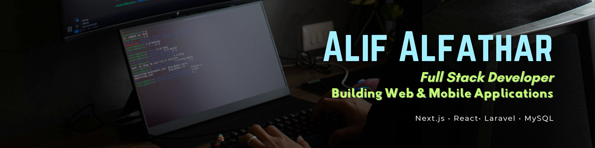

  

<h1 align="center">Hi 👋, I'm Alif Alfathar</h1>
<h3 align="center">Full Stack Developer | Backend Enthusiast 🇮🇩</h3>

Building scalable web applications and backend systems with modern technologies.

  

---

## 🚀 About Me

* 💻 Full Stack Developer with a strong interest in **Backend Development** and **Software Architecture**.
* ⚙️ Experienced in building **REST APIs, authentication systems, CRUD applications, and database-driven systems**.
* 🌱 Currently learning **Backend Architecture, Docker, and System Design**.
* 🎯 Goal: Become a **Software Engineer** specializing in scalable backend systems and modern web applications.
* 📚 Passionate about solving real-world problems through technology and continuously learning new tools and best practices.

---

## 🛠 Tech Stack

### Frontend

### Backend

### Database

### Tools & Others

---

## 📊 GitHub Stats

  
  

---

## 📌 Featured Projects

🛒 **E-Commerce Platform**
Full-stack e-commerce application with authentication, admin dashboard, and database integration.

📚 **Digital Library System**
Book borrowing and management system with role-based access and responsive interfaces.

💊 **Pharmacy Management System**
Inventory and sales management system built with PHP, Laravel, and MySQL.

📱 **Mobile Library Application**
Mobile application for digital library services built using Flutter and modern APIs.

📋 **Community Reporting System**
Complaint management and tracking system for public services.

---

## 🌱 Currently Learning

* Backend Architecture
* Docker
* System Design
* Clean Architecture
* Design Patterns
* Database Optimization

---

## 📫 Connect With Me

* 💼 LinkedIn: linkedin.com/in/alif-alfathar-183402407
* 📧 Email: [alifalfathar13@email.com](mailto:alifalfathar13@email.com)
* 🌐 Portfolio: Coming Soon...

---

  <i>"Building technology that solves real-world problems and creating impactful digital experiences."</i>

